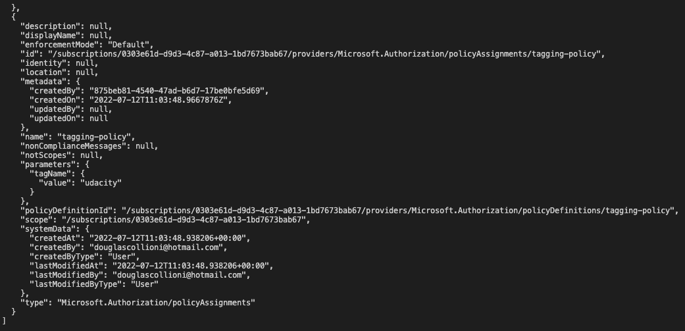

# Policy

1. Go to the [`/policy`](policy) folder

1. Create a Policy Definition by running:

    ```sh
    az policy definition create --name tagging-policy --rules ./tagging-policy-rules.json --params ./tagging-policy-params.json 
    ```

1. Create a Policy Assignment by running:

    ```sh
    az policy assignment create --name tagging-policy --policy tagging-policy -p "{ \"tagName\": { \"value\": \"udacity\" } }"
    ```

1. Check the Policy Assignment by running:

    ```sh
    az policy assignment list
    ```

1. The list should contain the recently created Policy Assignment like the following:

    
