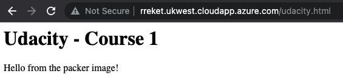

# Terraform

## Apply Plan

1. Go to the [`/terraform`](terraform) folder

1. Initialise terraform module by running:

    ```sh
    terraform init
    ```

1. Compile terraform module into a plan by running:

    ```sh
    terraform plan -out solution.plan
    ```

1. Apply (deploy) the plan by running:

    ```sh
    terraform apply solution.plan
    ```

    > This command will generate a `solution.plan` file inside the folder

1. Show the applied plan by running:

    ```sh
    terraform show
    ```

1. The outputs will show the public IP address and the public DNS to access the deployed server through the load balancer. Example of output:

    ```
    backend_public_ip = "20.90.51.62"
    backend_public_ip_dns = "rreket.ukwest.cloudapp.azure.com"
    ```

    By accessing the URL `http://rreket.ukwest.cloudapp.azure.com/udacity.html`, you should see the Udacity screen page:

    

## Destroy Plan

1. Destroy the applied plan by running:

    ```sh
    terraform destroy
    ```
